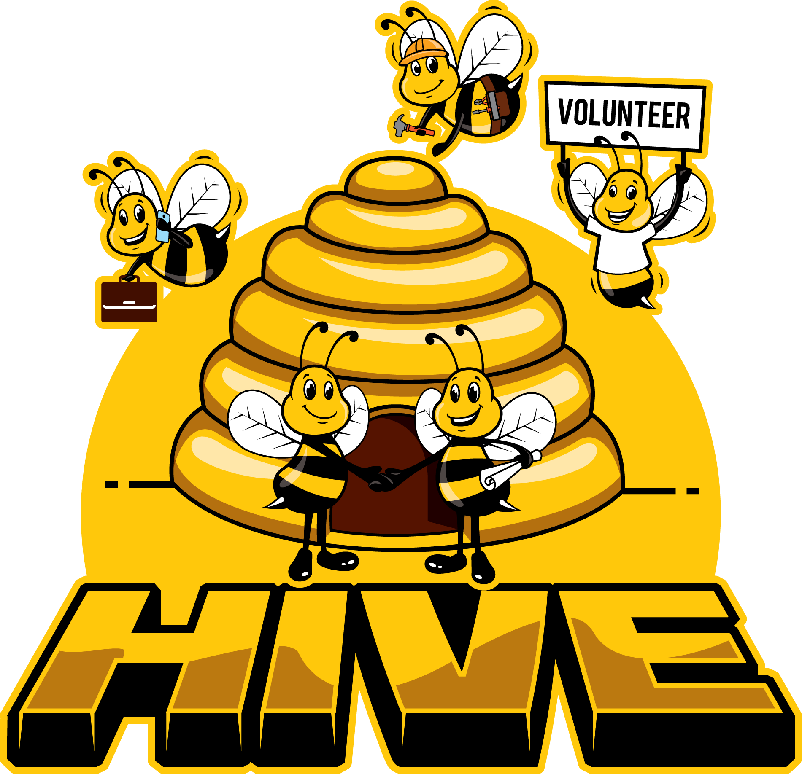

<p align="center">
  <a href="#" target="blank"></a>
</p>

## Description
<p align="center">
  Our App is a project collaboration platform to connect people with projects that are meaningful to them.
  Users can post projects and outline what they have to offer, as well as what they are looking for in respondents to the project.
  The types of projects that can be posted is only limited by the requirements that they meet with our predefined user agreement.
  Projects can be for profit, non-profit, private enterprise or community and social networking.
  Users of the app will be presented projects that match their skills and interests.
  <br />
  Our App will be the perfect place for people to find work, gain experience, develop skills and allow them to make meaningful contributions to community and society!
  <br />
  <br />
  <strong>"Connecting projects and people that have a passion for them!"</strong>
  <br /><br />
  Visit http://hivewebapi-env.eba-t2qg9pem.ca-central-1.elasticbeanstalk.com/api for API documentation and usage.
</p>

## Installation

```bash
$ npm install
```

## Running the app

```bash
# development
$ npm run start

# watch mode
$ npm run start:dev

# production mode
$ npm run start:prod
```

## Test

```bash
# unit tests
$ npm run test

# e2e tests
$ npm run test:e2e

# test coverage
$ npm run test:cov
```

## Stay in touch

- Author - Steven Lawrence

## License

Nest is [MIT licensed](LICENSE).
"# hive_api"
